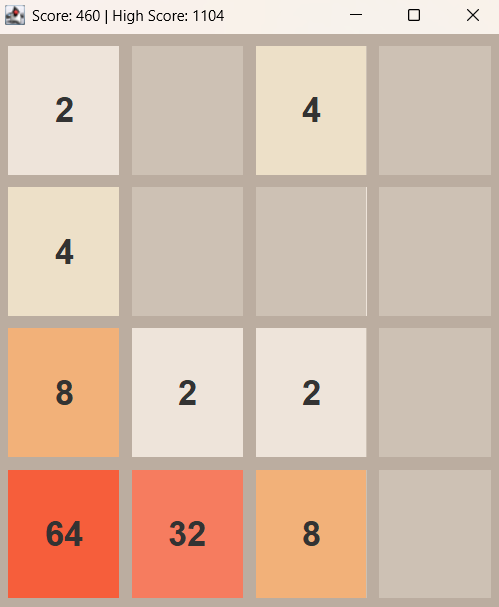
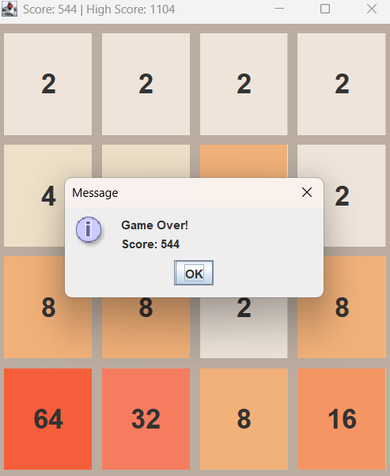

# 2048 Game using Java Swing

A desktop implementation of the classic **2048 puzzle game** built using Java Swing.  
It features smooth controls and persistent high score tracking.

---

## 📌 Description
Developed a desktop 2048 puzzle game with persistent high scores, smooth keyboard controls, and a user-friendly interface.

---

## 🛠️ Tools Used
- Java  
- Swing (GUI Framework)

---

## ✨ Features
- Classic 2048 gameplay  
- Smooth keyboard controls

## 📸 Screenshots




- High score tracking (saved locally)  
- Simple and user-friendly interface  

---

## 🚀 How to Run
1. Compile the program:
```bash
javac Game2048.java
